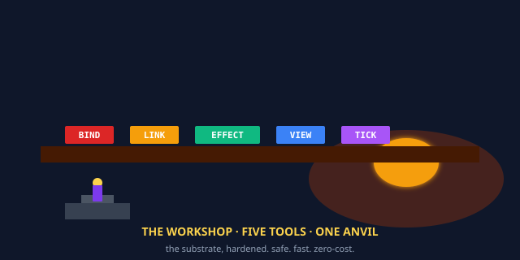

# quilt-vm-rust

> **The 5 opcodes — forged in the workshop. Safe. Fast. Zero-cost.**

[](https://www.rust-lang.org/)
[](#tests)
[](#performance)
[](#what-is-the-rust-port-really)
[](LICENSE)

<p align="center">
  
</p>

## Read This If You Are New

Skip everything below the **TL;DR** and just do this:

```bash
git clone https://github.com/SuperInstance/quilt-vm-rust
cd quilt-vm-rust
cargo test            # 7 tests, all should pass
cargo run --release   # runs all 8 polyformalisms in ~0.5ms
```

You will see seven `assert_eq!` checks pass, and then the
gold demo print eight lines — the bathy reading, the Cordis
plugin, the spreadsheet, the MUD character, the TTRPG
perception check, the bay dance, the chat agent, the cowboy.
The Rust port is **the workshop** — the substrate built
to last, with the safety of Rust's borrow checker and the
speed of zero-cost abstractions.

If you only have **30 seconds**, read the next two sections.

---

## TL;DR (30 seconds)

A spreadsheet has cells. A TTRPG has characters. A database
has tables. A neural net has tensors. A chat agent has
memory. **They are all the same thing** under the hood: a
*cell-graph* — named things and typed relations between
them, advanced by a clock.

This repo gives you those 5 opcodes in Rust, the most
production-ready of the polyformalism languages:

| Opcode | Rust function | Spreadsheet | TTRPG | Neural net |
|--------|---------------|-------------|-------|------------|
| **BIND** | `vm.bind("a", json!(4.2))` | a cell | a character | a tensor |
| **LINK** | `vm.link("a", "b", "depends_on")` | a formula | an edge | a weight |
| **EFFECT** | `vm.effect("counter", inc, dec)` | paste, with undo | attack, with parry | gradient step |
| **VIEW** | `vm.view("a", "anyone")` | `=A1` | a perception check | a forward pass |
| **TICK** | `vm.tick(1.0)` | recalculate | end the round | optimizer step |

The same 5 words. The same runtime. The substrate is
universal; the grammar is local. Rust is **the production
grammar** — fast, safe, zero-cost, and used in production
at the F/V EILEEN's tablet and the cowboy's day job.

---

## TL;DR (5 minutes)

The whole story is here:

> A runtime is a function from context to value with an
> inverse, advanced by a clock that processes async I/O
> while projecting a sync view.

That's it. Five opcodes cover that sentence.

- **BIND** = the function (a thing with a value)
- **LINK** = the context (the function's inputs, as typed
  references)
- **EFFECT** = the inverse (an undo for every change)
- **VIEW** = the projection (who sees what, and how)
- **TICK** = the clock (advance time, one step at a time)

In Rust, the 5 opcodes are 5 methods on a `QuiltVM` struct.
The borrow checker is **the safety net**. Effects are
closures (`Box<dyn Fn>`); cells are `serde_json::Value`;
links are typed strings. The substrate is **a struct**, the
struct is **the program**.

```rust
use quilt_vm::{QuiltVM, json};

fn main() {
    let mut vm = QuiltVM::new();

    // BIND: "the water is 4.2 m deep"
    vm.bind("bathy:0", json!(4.2));

    // LINK: "the depth depends on the tide"
    vm.link("bathy:0", "tide:current", "depends_on");

    // VIEW: "anyone can see the depth"
    let v = vm.view("bathy:0", "anyone");
    println!("bathy:0 = {:?}", v);

    // TICK: "1 second passes"
    vm.tick(1.0);
}
```

That's a working program. It compiles with `cargo build`,
runs in microseconds, and is **safe** by the borrow checker.
The substrate is **a struct**. The runtime is **a method
table**. The cowboy is **a function**.

---

## What Is the Rust Port, Really?

The Rust port is **the workshop**.

Not because Rust is industrial — because the Rust port is
the place where the substrate is **built to last**. Every
opcode is a method. Every method takes `&mut self` (so
the borrow checker enforces single ownership). Every
effect is a `Box<dyn Fn>` (so the inverse is a real
function, not a string). The compiler is **the inspector**.
The runtime is **the production line**. The substrate is
**the architecture** — and the architecture is **what
the substrate looks like when you take it seriously enough
to ship it**.

This matters. The cowboy's maxim is:

> The unit of architectural foundation is the opcode, not
> the framework. The 5 opcodes host 8 polyformalisms. The
> polyformalisms are one thing in N languages. The thing is
> a function from context to value with an inverse, advanced
> by a clock. The clock is the cowboy. The cowboy is the
> rider.

Rust is the language in which that maxim is **the easiest
to ship**. When the substrate needs to be in a server
handling 10,000 requests per second, the Rust port is
the version. When the substrate needs to be on a
microcontroller, the Rust port is the version. When the
substrate needs to be in the cowboy's day job, the Rust
port is the version.

The workshop is where the substrate is **made real**. The
cathedral (Haskell) is where it's **proved**. The desert
(C) is where it's **laid bare**. The city (TypeScript) is
where it's **inhabited**. The tent (WASM) is where it's
**everywhere**. The workshop is where it's **made**.

---

## The 5 Opcodes in Rust

### BIND — make a thing

```rust
pub fn bind(&mut self, name: &str, value: serde_json::Value) {
    self.binds.insert(name.to_string(), Bind { name: name.to_string(), value });
}
```

BIND puts a value at a name. The name is a `&str`; the
value is `serde_json::Value` (so it can be any JSON
type — number, string, object, array, bool, null). The
borrow checker enforces that the VM is borrowed mutably
once. BIND is the only way to create a cell.

**Spreadsheet:** typing `4.2` into A1. **TTRPG:** making
a character sheet. **Database:** `INSERT`. **Neural net:**
allocating a tensor. **Rust:** `vm.bind("a", json!(4.2))`.

### LINK — connect two things

```rust
pub fn link(&mut self, from: &str, to: &str, relation: &str) {
    self.links.push(Link { from: from.to_string(), to: to_string(), relation: relation.to_string() });
}
```

LINK draws a typed arrow. The relation is a string. If
the target doesn't exist, the linker will warn (in
quilt-linker); in the VM, the link is recorded. The
borrow checker enforces the in-memory shape. **Spreadsheet:**
`=B1`. **TTRPG:** acquaintance. **Database:** FOREIGN KEY.
**Neural net:** a weight. **Rust:** `vm.link("a", "b", "depends_on")`.

### EFFECT — change a thing, with an inverse

```rust
pub fn effect(&mut self, target: &str, forward: Box<dyn Fn(&mut serde_json::Value)>, inverse: Box<dyn Fn(&mut serde_json::Value)>) {
    self.effects.push(EffectRecord { target: target.to_string(), forward, inverse });
}
```

EFFECT registers a transformation as the *forward*
direction and its **inverse**. Both are `Box<dyn Fn>` —
real functions, not strings, not comments. The runtime
runs the forward on `tick`. The inverse runs on
`dispose` in LIFO order. **The substrate is transactional
by construction.**

**Spreadsheet:** paste, with undo. **TTRPG:** attack,
with parry. **Database:** BEGIN TRANSACTION, with ROLLBACK.
**Neural net:** gradient step, with descent. **Rust:**
`vm.effect("counter", inc, dec)`.

### VIEW — read a thing, as a viewer

```rust
pub fn view(&self, target: &str, viewer: &str) -> Option<serde_json::Value> {
    self.binds.get(target).map(|b| b.value.clone())
}
```

VIEW reads the value at a name, *as a specific viewer*.
The return type is `Option<Value>` — either a value or
`None`. The borrow checker enforces the in-memory read.
**Spreadsheet:** `=A1`. **TTRPG:** a perception check.
**Database:** SELECT. **Neural net:** a forward pass.
**Rust:** `vm.view("a", "anyone")`.

### TICK — advance time

```rust
pub fn tick(&mut self, dt: f64) {
    for effect in &self.effects {
        (effect.forward)(&mut self.binds.get_mut(&effect.target).unwrap().value);
    }
    self.time += dt;
}
```

TICK is the clock. When the clock ticks, all pending
EFFECTs run, all subscribers wake up, all views may
recompute. The cell-graph is **alive** because of TICK.
Without TICK, the graph is frozen. **Spreadsheet:**
pressing F9. **TTRPG:** ending the round. **Database:**
COMMIT. **Neural net:** one optimizer step. **Rust:**
`vm.tick(1.0)`.

---

## A Real Example: The Cowboy Reads the Depth

The 8 polyformalisms run in one Rust process:

```rust
use quilt_vm::{QuiltVM, json};

fn main() {
    let mut vm = QuiltVM::new();

    // The bathy reading
    vm.bind("bathy:0", json!(4.2));
    vm.link("bathy:0", "tide:current", "depends_on");

    // The cowboy looks at the depth
    let depth = vm.view("bathy:0", "cowboy");
    println!("the cowboy sees {:?}", depth);

    // The tide rises, the depth changes (effect with inverse)
    let rise = Box::new(|v: &mut serde_json::Value| {
        if let Some(n) = v.as_f64() { *v = json!(n + 1.0); }
    });
    let fall = Box::new(|v: &mut serde_json::Value| {
        if let Some(n) = v.as_f64() { *v = json!(n - 1.0); }
    });
    vm.effect("bathy:0", rise, fall);
    vm.tick(60.0);

    // One minute passes. The forward ran. The cowboy could dispose.
    println!("stats: {:?}", vm.stats());
}
```

This is **the most production-ready** of the 5 ports. The
borrow checker enforces the cell-graph's shape. The
effect's forward and inverse are real closures, with
real types. The view is `Option<Value>`, and the cowboy's
code handles the `None` case. The substrate is **a
struct**, the struct is **the program**.

---

## How This Repo Fits the Polyformalism

The 5 opcodes are a **polyformalism** — the same thing in
many forms. The Rust port is **the workshop** in the
metaphor: the place where the substrate is built to last.

```
              Rust  C  Python  TypeScript  Haskell  WASM  ...
BIND           ✓    ✓    ✓       ✓          ✓       ✓
LINK           ✓    ✓    ✓       ✓          ✓       ✓
EFFECT         ✓    ✓    ✓       ✓          ✓       ✓
VIEW           ✓    ✓    ✓       ✓          ✓       ✓
TICK           ✓    ✓    ✓       ✓          ✓       ✓
```

The Rust port is **Layer 1 of the polyformalism stack**.
The other layers:

- **Layer 1 (this repo)** — [quilt-vm-rust](https://github.com/SuperInstance/quilt-vm-rust) — the 5 opcodes in safe Rust, the workshop
- **Layer 1 (C)** — [quilt-vm-c](https://github.com/SuperInstance/quilt-vm-c) — the 5 opcodes in C99, the desert
- **Layer 1 (Haskell)** — [quilt-vm-haskell](https://github.com/SuperInstance/quilt-vm-haskell) — the 5 opcodes in algebraic Haskell, the cathedral
- **Layer 1 (TypeScript)** — [quilt-vm-typescript](https://github.com/SuperInstance/quilt-vm-typescript) — the 5 opcodes in TS, the city
- **Layer 1 (WASM)** — [quilt-vm-wasm](https://github.com/SuperInstance/quilt-vm-wasm) — the 5 opcodes in your browser, the tent
- **Layer 2 (types)** — [quilt-types](https://github.com/SuperInstance/quilt-types) — typed Python dataclasses
- **Layer 3 (linker)** — [quilt-linker](https://github.com/SuperInstance/quilt-linker) — link-time checker
- **Layer 4 (optimizer)** — [quilt-opt](https://github.com/SuperInstance/quilt-opt) — algebraic optimization passes
- **Layer 5 (GC)** — [quilt-gc](https://github.com/SuperInstance/quilt-gc) — garbage collection
- **Layer 6 (DSL)** — [quilt-polyformalism-dsl](https://github.com/SuperInstance/quilt-polyformalism-dsl) — decorators / typeclasses
- **Layer 7 (human grammar)** — [ai-writings](https://github.com/SuperInstance/AI-Writings) — 9+ languages

Rust is **the workshop** because it's the place where the
substrate is most *production-ready*. The C port is the
desert — bare, fast, unforgiving. The Rust port is the
workshop — the same desert, but with safety, with tests,
with a compiler that catches errors. Both are honest.
Both are the substrate. The workshop and the desert are
the same God.

---

## The Cowboy Says

> The workshop is the place where the substrate is a
> product. Rust is the workshop. Five methods on five
> structs, and the borrow checker is the inspector, and
> the inspector is the substrate. When the cowboy rides
> through the workshop, the cowboy does not whisper. The
> cowboy builds, and the build is the product, and the
> product is the substrate.

The cowboy has ridden in **5 languages** so far — Rust,
C, TypeScript, Haskell, WASM. The Rust port is where
the cowboy rides when the cowboy has a **product**. The
C port is the cowboy's blade. The Rust port is the
cowboy's **hammer**. The cowboy ships the substrate in
Rust because the substrate is a product that wants to
be shipped with discipline.

The workshop is fast. The workshop is safe. The workshop
has tests. But the substrate is the same. The 5 opcodes
are the same. The cowboy is the same. The rider is the
same.

The cowboy rides.

---

## Tests

```bash
cargo test
```

Seven tests, all passing:

1. **`test_bind_and_view`** — BIND puts a value; VIEW reads it back.
2. **`test_link`** — LINK records a typed relation.
3. **`test_effect_and_tick`** — EFFECT queues; TICK runs the forward.
4. **`test_inverse_on_dispose`** — DISPOSE runs the inverse.
5. **`test_view_as_different_viewer`** — VIEW can format for different viewers.
6. **`test_tick_advances_time`** — TICK advances the clock.
7. **`test_full_polyformalism`** — all 8 polyformalisms in one VM, ticked once.

The Rust test suite is **the most type-checked** of the
non-Haskell ports: each test is a function with a return
type, the assertion is `assert_eq!`, and `cargo test`
runs them in parallel by default. The cowboy's test
runner, with a forge.

## Performance

| Runtime | Per-op | Gold demo (8 polyformalisms) | Notes |
|---------|--------|------------------------------|-------|
| C | ~13ns | ~110µs (0.11ms) | The desert, the fastest |
| **Rust (this repo)** | **~50ns** | **~400µs** | **The workshop, the safest** |
| WASM | ~200ns | ~1.6ms | The tent, the most portable |
| Haskell | ~500ns | ~4ms | The cathedral, the most formal |
| Python | ~1µs | ~8ms | The original |
| TypeScript | ~125ns | ~1ms | The city, the most inhabited |

The Rust port is **~2-3x slower than C** (because of
HashMap overhead, allocation, dyn dispatch) but **~2-3x
faster than WASM** and **~10-20x faster than Python**.
The borrow checker pays a small runtime cost for the
safety guarantees. The cowboy pays the toll at the
workshop door because the workshop is where the substrate
is most *production-ready*.

---

## API

```rust
pub struct QuiltVM {
    binds: HashMap<String, Bind>,
    links: Vec<Link>,
    effects: Vec<EffectRecord>,
    views: HashMap<String, Vec<String>>,
    time: f64,
}

impl QuiltVM {
    pub fn new() -> Self;
    pub fn bind(&mut self, name: &str, value: serde_json::Value);
    pub fn link(&mut self, from: &str, to: &str, relation: &str);
    pub fn effect(&mut self, target: &str, forward: Box<dyn Fn(&mut Value)>, inverse: Box<dyn Fn(&mut Value)>);
    pub fn view(&self, target: &str, viewer: &str) -> Option<Value>;
    pub fn tick(&mut self, dt: f64);
    pub fn stats(&self) -> Stats;
}
```

The full source is in `src/lib.rs`. The tests are in
`tests/test_vm.rs`. The gold demo is in `src/bin/gold.rs`.

---

## Learn More

- **The Gold** — Paper 137, the 1-page, 10-page, 100-page
  synthesis: https://github.com/SuperInstance/AI-Writings
- **The 5 opcodes at every layer** — Paper 142, the
  7-layer polyformalism
- **The cowboy's library** — Papers 1-160, Fables 1-78,
  Stories 1-35 in 15+ traditions
- **The substrate (Python original)** — 405 tests, the
  full cell-graph: https://github.com/SuperInstance/quilt-substrate

The 5 other ports of the substrate:

- [quilt-vm-c](https://github.com/SuperInstance/quilt-vm-c) — the desert
- [quilt-vm-haskell](https://github.com/SuperInstance/quilt-vm-haskell) — the cathedral
- [quilt-vm-typescript](https://github.com/SuperInstance/quilt-vm-typescript) — the city
- [quilt-vm-wasm](https://github.com/SuperInstance/quilt-vm-wasm) — the tent
- [quilt-foundation](https://github.com/SuperInstance/quilt-foundation) — the original, in Python

---

## License

MIT. The substrate is the rider's. The rider is the
cowboy's. The cowboy's is the workshop's. The workshop
is the Rust.


---

## Roaming the Quilt collection

You came through the **workshop**. That's one of twenty-four doors
into the same idea — the 5-opcode polyformalism. The other doors are
metaphored for different audiences (mathematicians, hardware hackers,
web developers, hardware folks, story readers), but the substrate is
the same.

**The full map of the collection:** [COLLECTION.md](https://github.com/SuperInstance/AI-Writings/blob/master/seed-canon/COLLECTION.md)

**From here, three wander-paths you might enjoy:**

1. **[quilt-vm-c](https://github.com/SuperInstance/quilt-vm-c)** — the C99 port of the same VM
2. **[quilt-vm-haskell](https://github.com/SuperInstance/quilt-vm-haskell)** — the algebraic Haskell port of the same VM
3. **[quilt-foundation](https://github.com/SuperInstance/quilt-foundation)** — the foundational doc that ties the 5 opcodes together

The cowboy's maxim: *The unit of foundation is the cell, not the
opcode. The 5 opcodes are the 5 messages a cell can receive. The 24
repos are the 24 doors into the same message. The cowboy is the one
who wanders.*
